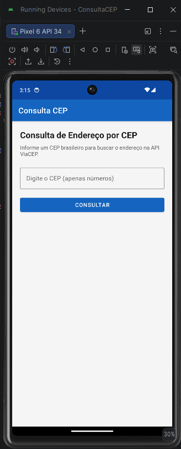
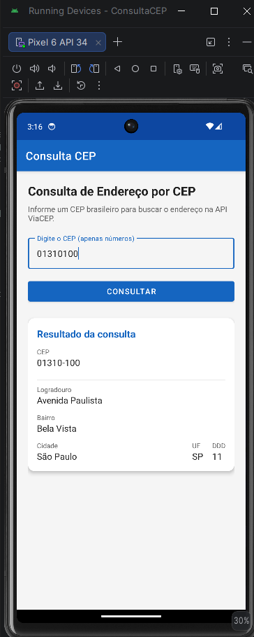
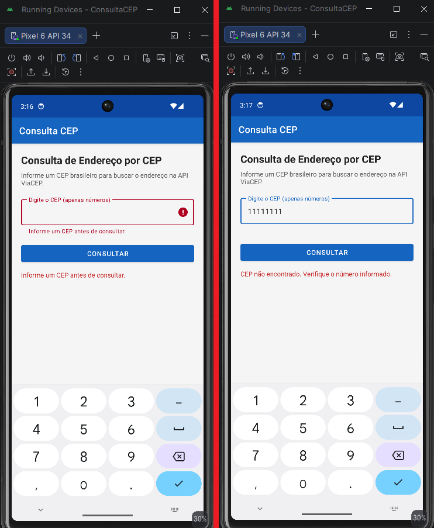

# Consulta CEP

## Descrição

App Android para consultar endereço pelo CEP. O usuário digita o CEP, o app busca na API ViaCEP e mostra logradouro, bairro, cidade e outros dados na tela.

## API utilizada

- Nome da API: ViaCEP
- Endpoint utilizado: `https://viacep.com.br/ws/{cep}/json/`
- Exemplo de URL consultada: `https://viacep.com.br/ws/01310100/json/`
- Principais dados retornados: CEP, logradouro, bairro, cidade, UF e DDD

## Funcionalidades

- Entrada de dados pelo usuário
- Validação de campo vazio
- Consulta a uma API pública
- Exibição dos dados retornados
- Tratamento básico de erro

## Tecnologias utilizadas

- Kotlin
- Android Studio
- XML
- Volley
- API pública ViaCEP

## Permissões utilizadas

O aplicativo utiliza a permissão INTERNET para realizar requisições à API pública.

```xml
<uses-permission android:name="android.permission.INTERNET" />
```

## Requisitos

Os itens abaixo estão listados como **orientação de segurança** para quem for clonar e executar o projeto pela primeira vez. Nos testes realizados, o app **rodou sem problemas** na máquina de desenvolvimento e também em **outra máquina/pasta** após clonar o repositório do GitHub (Android Studio + Gradle sync + emulador API 34).

Para abrir e executar o projeto:

- **Android Studio** (versão recente)
- **JDK 17 ou superior** (já incluso no Android Studio — não precisa instalar Java separado)
- **Android SDK 34** (Android 14) — se o Gradle pedir, clique em **Install** ou **Accept** na sincronização
- **Gradle Wrapper** incluso no repositório (`gradlew` / `gradlew.bat`) — não é necessário instalar Gradle manualmente
- **Internet** ativa no emulador ou celular (o app consulta a API ViaCEP online)

**Testado em:** emulador Pixel 6, API 34 (Android 14), com CEP `01310100`. Clone do repositório testado com sucesso em ambiente separado.

## Como executar o projeto

1. Clonar este repositório:
   ```bash
   git clone https://github.com/yanzao420/atividade-api-mobile-yanmendonca.git
   ```
2. Abrir a pasta clonada no **Android Studio** (File → Open).
3. Aguardar a **sincronização do Gradle** (pode demorar na primeira vez).
   - Se aparecer aviso para instalar o **SDK 34** ou componentes do Android, aceite e aguarde o download.
4. Criar ou selecionar um emulador/dispositivo com **API 34** (ou superior).
5. Clicar em **Run** (▶) para instalar e abrir o app.
6. Informar um CEP válido (ex.: `01310100`) e tocar em **Consultar**.

> **Importante:** o emulador precisa de internet. Se a consulta falhar, verifique a conexão Wi‑Fi do emulador ou teste em um celular físico com dados/Wi‑Fi.

## Prints do aplicativo







## Autor

Yan Mendonça — Matrícula 2577554
